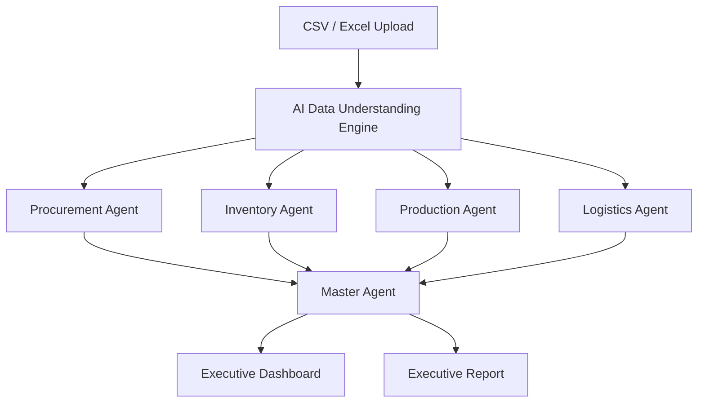
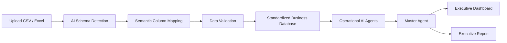
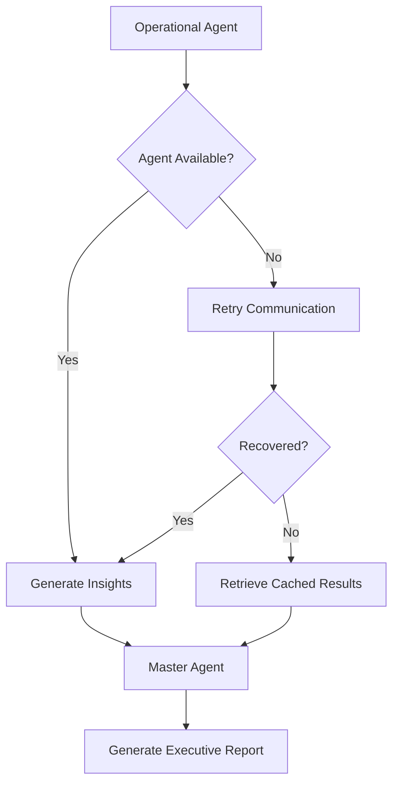

# AI-Powered Fault-Tolerant Multi-Agent Supply Chain Control Tower

<h3 align="center">
Intelligent • Autonomous • Resilient • Enterprise Ready
</h3>

An AI-driven Multi-Agent Supply Chain Intelligence Platform that transforms heterogeneous business data into actionable insights through autonomous agents and intelligent decision-making.

---

# Overview

The **AI-Powered Fault-Tolerant Multi-Agent Supply Chain Control Tower** is an intelligent decision-support platform designed to monitor, analyze, and optimize end-to-end supply chain operations.

Traditional supply chains depend on disconnected systems across procurement, inventory, production, and logistics. This creates problems such as fragmented data, delayed decisions, operational risks, and inefficient coordination.

This platform introduces a **Multi-Agent AI Architecture**, where every operational department is managed by a specialized AI agent. These agents analyze domain-specific data and communicate insights to a centralized **Master Agent**.

The Master Agent coordinates all agents, evaluates business risks, monitors system health, and generates executive-level intelligence reports.

---

# Problem Statement

Modern supply chain operations face several challenges:

- Lack of centralized visibility
- Fragmented operational data
- Manual analysis and reporting
- Inventory shortages and overstocking
- Production bottlenecks
- Shipment delays
- Poor coordination between departments
- Limited predictive intelligence
- Slow business decision-making

Organizations require an intelligent system that can understand different business datasets and provide automated recommendations.

---

# Proposed Solution

The proposed platform provides a fault-tolerant Multi-Agent AI system capable of:

- Understanding different CSV and Excel formats
- Automatically detecting business schemas
- Mapping data based on business meaning
- Routing information to appropriate AI agents
- Generating operational insights
- Producing executive recommendations

---

# System Architecture

---

# Multi-Agent Architecture

| Agent | Responsibilities | Output |
|---|---|---|
| Procurement Agent | Supplier analysis, purchase order monitoring, vendor risk evaluation | Procurement Intelligence |
| Inventory Agent | Stock monitoring, inventory forecasting, reorder recommendations | Inventory Intelligence |
| Production Agent | Production analysis, scheduling, machine utilization, bottleneck detection | Production Intelligence |
| Logistics Agent | Shipment tracking, delivery monitoring, ETA prediction, route analysis | Logistics Intelligence |
| Master Agent | Agent orchestration, risk evaluation, workflow management, executive reporting | Business Decision Intelligence |

---

# AI Data Understanding Engine

The platform supports dynamic data ingestion without requiring predefined templates.

## Supported Formats

- CSV (.csv)
- Excel (.xls)
- Excel (.xlsx)

The AI automatically performs:

- Schema detection
- Semantic column understanding
- Data validation
- Data cleaning
- Business entity extraction
- Intelligent data routing

## Semantic Column Mapping

| Uploaded Column | AI Interpretation | Standard Field |
|---|---|---|
| Vendor ID | Supplier Identifier | supplier_id |
| Supplier Code | Supplier Identifier | supplier_id |
| Vendor Name | Supplier Name | supplier_name |
| Qty | Inventory Quantity | current_stock |
| Warehouse Stock | Inventory Quantity | current_stock |

The system understands the meaning of data instead of depending on exact column names.

---

# Data Processing Pipeline

---

# Operational Dashboards

## Procurement Dashboard

Features:

- Supplier performance analysis
- Purchase order monitoring
- Vendor risk detection
- Procurement KPIs
- AI recommendations

## Inventory Dashboard

Features:

- Warehouse monitoring
- Stock availability analysis
- Low-stock detection
- Overstock identification
- Inventory forecasting

## Production Dashboard

Features:

- Production monitoring
- Machine utilization analysis
- Manufacturing KPIs
- Bottleneck detection
- Schedule optimization

## Logistics Dashboard

Features:

- Shipment monitoring
- Delivery tracking
- ETA prediction
- Route analysis
- Logistics performance evaluation

---

# Executive Dashboard

The Executive Dashboard is powered by the Master Agent and provides a unified supply chain intelligence view.

## Provides:

- Overall supply chain health
- Operational risk analysis
- Agent health monitoring
- Critical business alerts
- Cross-department insights
- AI recommendations
- Executive reports

---

# Fault-Tolerant Architecture

The platform continues operating even when individual AI agents experience failures.

## Capabilities

- Agent health monitoring
- Automatic failure detection
- Retry mechanism
- Cached result recovery
- Graceful degradation
- Confidence-based reporting

---

# Fault Recovery Workflow

---

# Key Features

- Multi-Agent AI Architecture
- Centralized Master Agent
- Dynamic CSV and Excel Processing
- Semantic Data Understanding
- Automated Data Mapping
- Department-Level Intelligence Dashboards
- Predictive Risk Analysis
- Agent Communication Framework
- Fault-Tolerant Workflow
- Executive Decision Support

---

# Supported Industries

| Industry | Status |
|---|---|
| Manufacturing | Supported |
| Retail | Supported |
| Healthcare | Supported |
| Logistics | Supported |
| Automotive | Supported |
| E-Commerce | Supported |
| Warehousing | Supported |
| Food and Beverage | Supported |

---

# Future Enhancements

- ERP Integration
- Real-Time IoT Monitoring
- Digital Twin Visualization
- Blockchain-Based Traceability
- Predictive Demand Forecasting
- Real-Time Event Streaming
- AI Voice Assistant
- Autonomous Workflow Automation

---

# Vision

To build an intelligent, fault-tolerant, industry-independent AI platform where autonomous agents collaborate to transform complex supply chain data into reliable business decisions.

---

Built with Artificial Intelligence, Multi-Agent Systems, and Enterprise Automation

