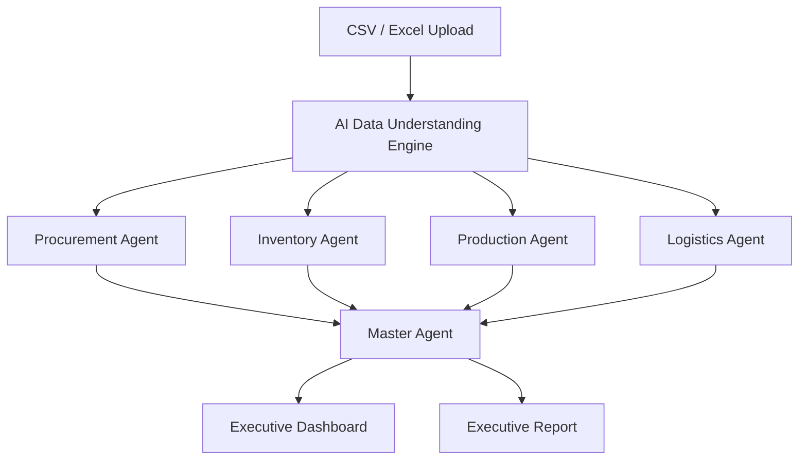
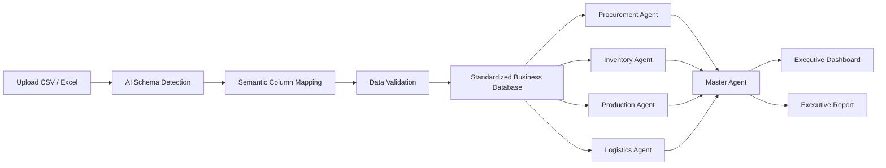
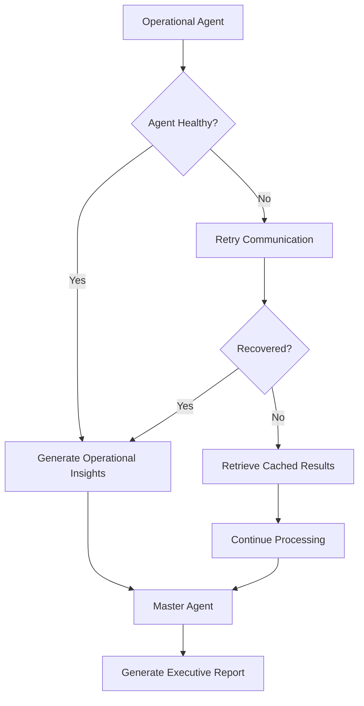

````markdown
# AI-Powered Fault-Tolerant Multi-Agent Supply Chain Control Tower

<p align="center">
  <h3 align="center">
    Intelligent • Autonomous • Fault-Tolerant • Enterprise Ready
  </h3>

  <p align="center">
    An enterprise-grade Multi-Agent AI platform that transforms heterogeneous supply chain data into actionable business intelligence through dynamic data understanding, intelligent agent collaboration, and resilient decision-making.
  </p>
</p>

---

## Overview

The **AI-Powered Fault-Tolerant Multi-Agent Supply Chain Control Tower** is an enterprise decision-support platform that enables organizations to monitor, analyze, and optimize their end-to-end supply chain operations.

Traditional supply chains often rely on disconnected systems for Procurement, Inventory, Production, and Logistics. As a result, organizations struggle with fragmented data, delayed decision-making, limited operational visibility, and inefficient collaboration between departments.

This platform introduces a **Fault-Tolerant Multi-Agent Architecture**, where each operational domain is managed by a specialized AI agent. Every agent analyzes its own business data independently and communicates intelligent insights to a centralized **Master Agent**, which orchestrates the workflow, evaluates business risks, and generates executive-level reports for decision-makers.

A key innovation of this platform is its **AI-powered Data Understanding Engine**, capable of dynamically reading CSV and Excel files from different organizations, understanding different schemas, mapping business concepts automatically, and routing data to the correct AI agent without requiring predefined templates.

The platform is designed to be industry-independent, scalable, and resilient, making it suitable for organizations of different sizes and sectors.

---

# Problem Statement

Modern supply chain operations involve coordinating procurement, inventory, production, and logistics across multiple stakeholders and business systems.

Most organizations still rely on disconnected applications, spreadsheets, or ERP exports, making it difficult to obtain a unified view of the entire supply chain.

This results in:

- Limited visibility across departments
- Delayed supplier information
- Inventory shortages and overstocking
- Production bottlenecks
- Shipment delays
- Manual operational analysis
- Poor inter-department coordination
- Lack of predictive intelligence
- Slow business decision-making

Existing enterprise solutions are often expensive, require standardized data formats, and provide limited AI-driven decision support.

Organizations need an intelligent, fault-tolerant platform capable of understanding different business data formats while providing automated operational insights and executive recommendations.

---

# Proposed Solution

The proposed platform introduces a **Multi-Agent AI Architecture** with a centralized **Master Agent**.

Each operational department is assigned its own specialized AI agent responsible for continuously analyzing domain-specific data.

Instead of making isolated decisions, every operational agent communicates its findings to the Master Agent.

The Master Agent combines these insights, identifies operational dependencies, evaluates business risks, monitors agent health, and generates comprehensive executive reports for management.

The platform also includes an **AI Data Understanding Engine** capable of dynamically reading CSV and Excel files from multiple organizations and automatically understanding different business schemas without requiring fixed templates.

---

# System Architecture



---

# Multi-Agent Architecture

| Agent | Primary Responsibilities | Dashboard | Accepted Data |
|:------|:-------------------------|:----------|:--------------|
| **Procurement Agent** | Supplier analysis, purchase order monitoring, procurement risk analysis, supplier performance evaluation | Procurement Dashboard | Supplier Records, Vendor Data, Purchase Orders |
| **Inventory Agent** | Warehouse monitoring, stock analysis, inventory forecasting, reorder recommendations | Inventory Dashboard | Inventory Records, Warehouse Data, Product Stock |
| **Production Agent** | Manufacturing monitoring, production scheduling, machine utilization, bottleneck prediction | Production Dashboard | Production Jobs, Manufacturing Records, Machine Data |
| **Logistics Agent** | Shipment tracking, delivery monitoring, transportation analysis, ETA prediction | Logistics Dashboard | Shipment Records, Delivery Orders, Logistics Data |
| **Master Agent** | Agent orchestration, business risk analysis, workflow management, executive reporting | Executive Dashboard | Insights received from all operational agents |

---

# Dynamic AI Data Understanding

Every operational dashboard contains its own intelligent upload portal.

Supported file formats:

- CSV (.csv)
- Excel (.xlsx)
- Excel (.xls)

The platform does not rely on predefined templates.

Instead, the AI automatically:

- Reads uploaded files
- Detects business entities
- Understands column meanings
- Maps semantic relationships
- Validates business data
- Cleans inconsistent records
- Standardizes schemas
- Routes data to the correct AI agent

### Semantic Column Mapping

| Uploaded Column | AI Interpretation | Standard Field |
|:----------------|:------------------|:---------------|
| Vendor ID | Supplier Identifier | `supplier_id` |
| Supplier Code | Supplier Identifier | `supplier_id` |
| Business Partner ID | Supplier Identifier | `supplier_id` |
| Vendor Name | Supplier Name | `supplier_name` |
| Supplier | Supplier Name | `supplier_name` |
| Qty | Current Inventory | `current_stock` |
| Available Quantity | Current Inventory | `current_stock` |
| Warehouse Stock | Current Inventory | `current_stock` |

Instead of matching exact column names, the platform understands the **business meaning** of uploaded data, allowing organizations to use files exported from different ERP systems without modification.

---

# Dynamic Data Processing Pipeline



---

# Operational Dashboards

Every operational AI agent has its own dedicated dashboard.

## Procurement Dashboard

Features:

- Supplier Overview
- Purchase Orders
- Supplier Performance
- Procurement KPIs
- Procurement Risk Analysis
- AI Recommendations
- CSV & Excel Upload

---

## Inventory Dashboard

Features:

- Inventory Overview
- Warehouse Status
- Low Stock Alerts
- Overstock Detection
- Inventory KPIs
- AI Recommendations
- CSV & Excel Upload

---

## Production Dashboard

Features:

- Production Jobs
- Manufacturing Performance
- Machine Utilization
- Production KPIs
- Bottleneck Detection
- AI Recommendations
- CSV & Excel Upload

---

## Logistics Dashboard

Features:

- Shipment Tracking
- Delivery Monitoring
- ETA Prediction
- Logistics KPIs
- Route Analysis
- AI Recommendations
- CSV & Excel Upload

---

# Executive Dashboard

The Executive Dashboard is powered by the **Master Agent** and provides a unified operational view of the entire supply chain.

Displays:

- Overall Supply Chain Health
- Procurement Summary
- Inventory Summary
- Production Summary
- Logistics Summary
- AI Agent Health Status
- Critical Business Alerts
- Operational Risk Analysis
- Executive KPIs
- Workflow Monitoring
- Confidence Scores
- Recommended Business Actions
- Executive Reports

---

# Final Executive Report

The Master Agent generates a comprehensive executive report by combining insights from all operational AI agents.

The report contains:

- Executive Summary
- Procurement Analysis
- Inventory Analysis
- Production Analysis
- Logistics Analysis
- Critical Operational Issues
- Root Cause Analysis
- Cross-Department Dependencies
- Business Impact Assessment
- Risk Level
- AI Recommendations
- Corrective Actions
- Confidence Score
- Report Timestamp
- Agent Contribution Summary

---

# Fault-Tolerant Architecture

The platform continues operating even when one or more AI agents fail.

Capabilities include:

- Continuous Agent Health Monitoring
- Automatic Failure Detection
- Retry Mechanism
- Graceful Degradation
- Cached Data Recovery
- Automatic Agent Recovery
- Confidence-Based Decision Reporting

---

# Fault-Tolerant Workflow



---

# Key Features

- Multi-Agent AI Architecture
- Centralized Master Agent
- Dynamic CSV & Excel Processing
- AI Semantic Data Mapping
- Industry-Independent Data Understanding
- Dedicated Operational Dashboards
- Executive Decision Dashboard
- Intelligent Business Risk Analysis
- Cross-Agent Communication
- Agent Health Monitoring
- Fault-Tolerant Workflow
- Executive Report Generation
- Predictive Analytics
- Modular Enterprise Architecture

---

# Supported Industries

| Industry | Status |
|:---------|:------:|
| Manufacturing | Supported |
| Retail | Supported |
| E-Commerce | Supported |
| Healthcare | Supported |
| Food & Beverage | Supported |
| Logistics | Supported |
| Automotive | Supported |
| Warehousing | Supported |
| Distribution | Supported |
| Small & Medium Enterprises | Supported |

---

# Future Enhancements

- ERP Integration
- IoT Device Integration
- Real-Time GPS Tracking
- Blockchain-Based Supply Chain Traceability
- Predictive Demand Forecasting
- Digital Twin Visualization
- AI Voice Assistant
- Autonomous Workflow Automation
- Real-Time Event Streaming
- Multi-Language AI Support

---

# Vision

To build an intelligent, fault-tolerant, industry-independent AI platform that empowers organizations to transform heterogeneous operational data into reliable business intelligence through autonomous AI agents, resilient workflows, and executive decision support.
````
