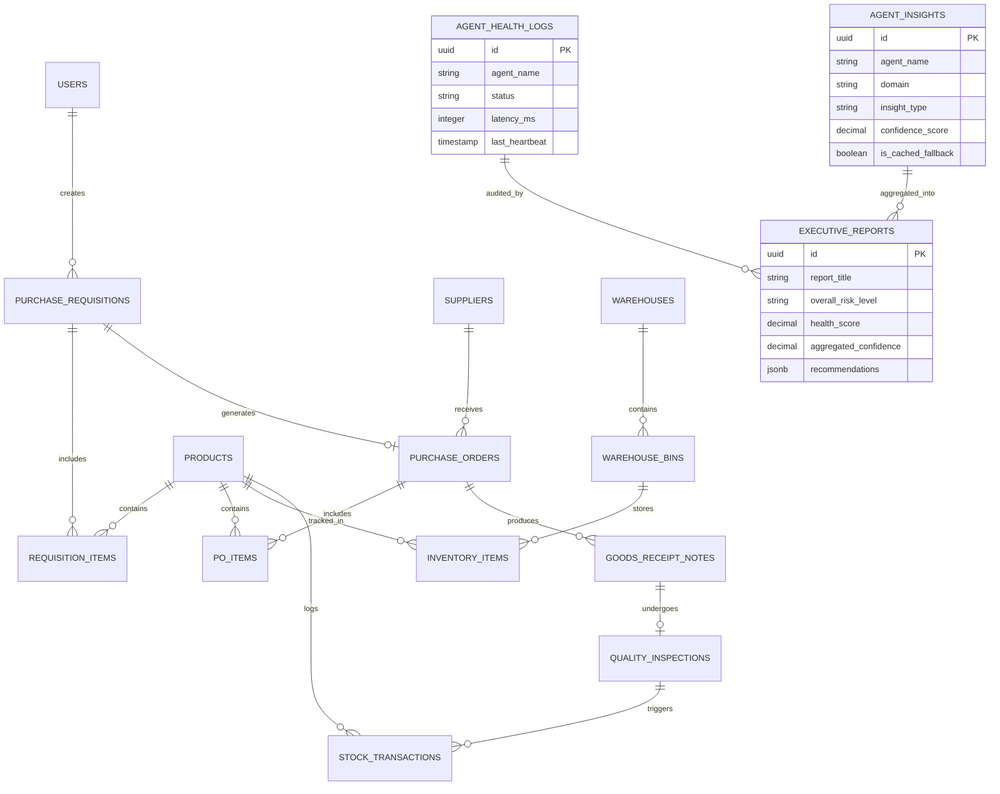

# 🗄️ Database Entity-Relationship (ER) Diagram

```mermaid
erDiagram
    USERS ||--o{ PURCHASE_REQUISITIONS : creates
    SUPPLIERS ||--o{ PURCHASE_ORDERS : receives
    PRODUCTS ||--o{ REQUISITION_ITEMS : contains
    PRODUCTS ||--o{ PO_ITEMS : contains
    PRODUCTS ||--o{ INVENTORY_ITEMS : tracked_in
    PRODUCTS ||--o{ STOCK_TRANSACTIONS : logs

    PURCHASE_REQUISITIONS ||--o{ REQUISITION_ITEMS : includes
    PURCHASE_REQUISITIONS ||--o| PURCHASE_ORDERS : generates
    PURCHASE_ORDERS ||--o{ PO_ITEMS : includes
    PURCHASE_ORDERS ||--o{ GOODS_RECEIPT_NOTES : produces

    GOODS_RECEIPT_NOTES ||--o| QUALITY_INSPECTIONS : undergoes
    QUALITY_INSPECTIONS ||--o{ STOCK_TRANSACTIONS : triggers

    WAREHOUSES ||--o{ WAREHOUSE_BINS : contains
    WAREHOUSE_BINS ||--o{ INVENTORY_ITEMS : stores

    AGENT_HEALTH_LOGS ||--o{ EXECUTIVE_REPORTS : audited_by
    AGENT_INSIGHTS ||--o{ EXECUTIVE_REPORTS : aggregated_into

    AGENT_HEALTH_LOGS {
        uuid id PK
        string agent_name
        string status
        integer latency_ms
        timestamp last_heartbeat
    }

    AGENT_INSIGHTS {
        uuid id PK
        string agent_name
        string domain
        string insight_type
        decimal confidence_score
        boolean is_cached_fallback
    }

    EXECUTIVE_REPORTS {
        uuid id PK
        string report_title
        string overall_risk_level
        decimal health_score
        decimal aggregated_confidence
        jsonb recommendations
    }
```
