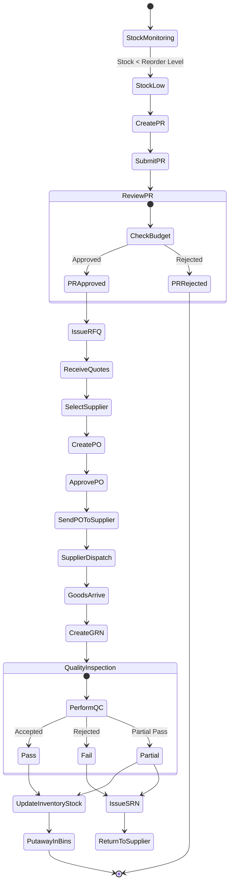

# 📐 Activity Diagram: Procurement & Receiving Workflow

```mermaid
stateDiagram-v2
    [*] --> StockMonitoring
    StockMonitoring --> StockLow: Stock < Reorder Level
    StockLow --> CreatePR
    CreatePR --> SubmitPR
    SubmitPR --> ReviewPR

    state ReviewPR {
        [*] --> CheckBudget
        CheckBudget --> PRApproved: Approved
        CheckBudget --> PRRejected: Rejected
    }

    PRRejected --> [*]
    PRApproved --> IssueRFQ
    IssueRFQ --> ReceiveQuotes
    ReceiveQuotes --> SelectSupplier
    SelectSupplier --> CreatePO
    CreatePO --> ApprovePO
    ApprovePO --> SendPOToSupplier

    SendPOToSupplier --> SupplierDispatch
    SupplierDispatch --> GoodsArrive
    GoodsArrive --> CreateGRN
    CreateGRN --> QualityInspection

    state QualityInspection {
        [*] --> PerformQC
        PerformQC --> Pass: Accepted
        PerformQC --> Fail: Rejected
        PerformQC --> Partial: Partial Pass
    }

    Pass --> UpdateInventoryStock
    Fail --> IssueSRN
    Partial --> UpdateInventoryStock
    Partial --> IssueSRN

    IssueSRN --> ReturnToSupplier
    UpdateInventoryStock --> PutawayInBins
    PutawayInBins --> [*]
```
