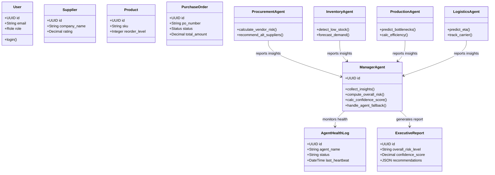

# 📐 Class Diagram: Domain Entities & Multi-Agent Architecture

```mermaid
classDiagram
    class User {
        +UUID id
        +String email
        +Role role
        +login()
    }

    class Supplier {
        +UUID id
        +String company_name
        +Decimal rating
    }

    class Product {
        +UUID id
        +String sku
        +Integer reorder_level
    }

    class PurchaseOrder {
        +UUID id
        +String po_number
        +Status status
        +Decimal total_amount
    }

    class ProcurementAgent {
        +calculate_vendor_risk()
        +recommend_alt_suppliers()
    }

    class InventoryAgent {
        +detect_low_stock()
        +forecast_demand()
    }

    class ProductionAgent {
        +predict_bottlenecks()
        +calc_efficiency()
    }

    class LogisticsAgent {
        +predict_eta()
        +track_carrier()
    }

    class ManagerAgent {
        +UUID id
        +collect_insights()
        +compute_overall_risk()
        +calc_confidence_score()
        +handle_agent_fallback()
    }

    class AgentHealthLog {
        +UUID id
        +String agent_name
        +String status
        +DateTime last_heartbeat
    }

    class ExecutiveReport {
        +UUID id
        +String overall_risk_level
        +Decimal confidence_score
        +JSON recommendations
    }

    ProcurementAgent --> ManagerAgent : reports insights
    InventoryAgent --> ManagerAgent : reports insights
    ProductionAgent --> ManagerAgent : reports insights
    LogisticsAgent --> ManagerAgent : reports insights

    ManagerAgent --> AgentHealthLog : monitors health
    ManagerAgent --> ExecutiveReport : generates report
```
