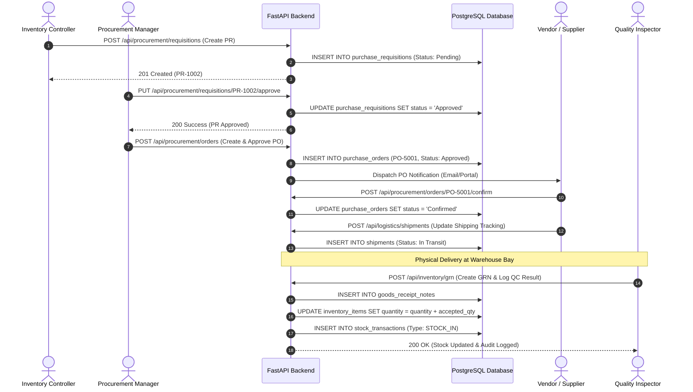

# 📐 Sequence Diagram: Procurement & Receiving Lifecycle

```mermaid
sequenceDiagram
    autonumber
    actor Controller as Inventory Controller
    actor Manager as Procurement Manager
    participant App as FastAPI Backend
    participant DB as PostgreSQL Database
    actor Supplier as Vendor / Supplier
    actor Inspector as Quality Inspector

    Controller->>App: POST /api/procurement/requisitions (Create PR)
    App->>DB: INSERT INTO purchase_requisitions (Status: Pending)
    App-->>Controller: 201 Created (PR-1002)

    Manager->>App: PUT /api/procurement/requisitions/PR-1002/approve
    App->>DB: UPDATE purchase_requisitions SET status = 'Approved'
    App-->>Manager: 200 Success (PR Approved)

    Manager->>App: POST /api/procurement/orders (Create & Approve PO)
    App->>DB: INSERT INTO purchase_orders (PO-5001, Status: Approved)
    App->>Supplier: Dispatch PO Notification (Email/Portal)

    Supplier->>App: POST /api/procurement/orders/PO-5001/confirm
    App->>DB: UPDATE purchase_orders SET status = 'Confirmed'

    Supplier->>App: POST /api/logistics/shipments (Update Shipping Tracking)
    App->>DB: INSERT INTO shipments (Status: In Transit)

    Note over App,Inspector: Physical Delivery at Warehouse Bay
    Inspector->>App: POST /api/inventory/grn (Create GRN & Log QC Result)
    App->>DB: INSERT INTO goods_receipt_notes
    App->>DB: UPDATE inventory_items SET quantity = quantity + accepted_qty
    App->>DB: INSERT INTO stock_transactions (Type: STOCK_IN)
    App-->>Inspector: 200 OK (Stock Updated & Audit Logged)
```
