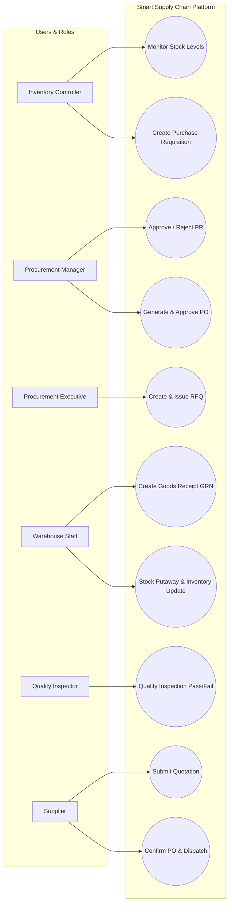

# 📐 Use Case Diagram & Specifications

## Primary Use Cases
1. **UC-01: Requisition Creation**: Triggered automatically on low stock or manually by Inventory Controller.
2. **UC-02: PO Issuance**: Procurement Executive selects winning vendor bid, Manager approves PO, System issues PO to Supplier.
3. **UC-03: Quality Receiving**: Warehouse logs GRN, Quality Inspector records test results, System updates stock balance or generates SRN.
